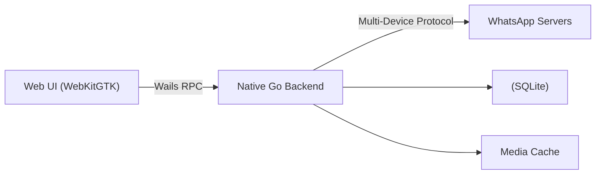

# Whats4Linux 🐧💬


    [](https://github.com/lugvitc/whats4linux/actions/workflows/format.yaml) [](https://github.com/lugvitc/whats4linux/actions/workflows/build.yaml)


**Whats4Linux** is an unofficial WhatsApp client for Linux with a **native Go backend** and a **lightweight WebKit-based UI**.

It is **not a wrapper around WhatsApp Web**.  
Instead, it directly connects to WhatsApp using the official multi-device protocol via [`whatsmeow`](https://github.com/tulir/whatsmeow).

The goal of Whats4Linux is to provide a **fast, efficient, Linux-first desktop client** without Electron, Chromium, or browser automation.

---

## ✨ Key Highlights

- Uses **WhatsApp’s real multi-device APIs**
- Native **Go backend** for networking, crypto, and storage
- Lightweight UI rendered using **WebKitGTK (via Wails)**
- No Electron, no Node.js, no Chromium
- **Linux-first** in spirit, cross-platform by design.

---

## 🧠 Architecture

Whats4Linux follows a **native-backed, web-rendered** architecture:



### What is native?
- WhatsApp protocol implementation
- Encryption & crypto
- Message sync & pagination
- Database access
- Media handling
- IPC between frontend and backend

### What is not native?
- UI widgets (HTML/CSS instead of GTK/Qt)

---

## 🚀 Features

### Messaging
- One-to-one chats
- Group chats
- Full chat history sync (TODO)

### Media & Storage
- Linux-native media cache
- SQLite-backed message storage
- Optimized database configuration for chat workloads

### Performance
- Lower memory usage than Electron clients
- No Chromium overhead
- Minimal JS ↔ Go IPC
- Tuned SQLite queries and cache sizes

### Privacy & Security
- Uses WhatsApp’s official encryption via whatsmeow
- No telemetry
- No analytics
- All data stored locally

### Customisation
- Custom JS, CSS allowed
- Custom Bezier curve editor for UI animations
- Easy to use colour scheme editor

---

## 🐧 Linux-First Design

Whats4Linux is built specifically for Linux:
- Uses WebKitGTK instead of Chromium
- Respects XDG base directories
- Designed for long-running sessions
- Works on both Wayland and X11

### Settings Page


### Login Page

<!-- TODO: add separate gallery page -->

---

## 🛠 Tech Stack

| Component | Technology |
|--------|-----------|
| Backend | Go |
| WhatsApp API | whatsmeow |
| UI Framework | Wails |
| Web Engine | WebKitGTK |
| Database | SQLite |
| IPC | Wails RPC bindings |

---

## 📦 Building

> ⚠️ Project is under active development

```bash
git clone https://github.com/lugvitc/whats4linux
cd whats4linux
wails build
```

This will produce a binary in the `build/bin/` directory.

## 🧪 Development Notes

- The backend exposes strongly-typed APIs to the frontend via Wails bindings.
- Message pagination is optimized for large chat histories.
- SQLite is tuned using WAL mode and controlled cache sizes for high-throughput reads.
- Media loading is lazy to avoid unnecessary memory usage.
- UI performance is carefully tuned to minimize scroll jank and IPC overhead.
- Designed for long-running sessions without gradual memory bloat.

---

## Contributing

Contributions are what make the open source community such an amazing place to be learn, inspire, and create. Any contributions you make are **greatly appreciated**.
* If you have suggestions for adding or removing features, feel free to [open an issue](https://github.com/lugvitc/whats4linux/issues/new) to discuss it, or directly create a pull request after you edit the *README.md* file with necessary changes.
* Please make sure you check your spelling and grammar.
* Create individual PR for each suggestion.

---

### Creating A Pull Request

1. Fork the Project
2. Create your Feature Branch (`git checkout -b feature/AmazingFeature`)
3. Commit your Changes (`git commit -m 'Add some AmazingFeature'`)
4. Push to the Branch (`git push origin feature/AmazingFeature`)
5. Open a Pull Request
---

## ⚠️ Disclaimer

Whats4Linux is an **unofficial WhatsApp client** and is **not affiliated with, endorsed by, or connected to WhatsApp or Meta** in any way.

Use at your own risk.

---

## 📜 License


This project is licensed under the **GNU Affero General Public License v3.0 (AGPL-3.0)**.

You are free to:
- Use the software
- Study and modify the source code
- Redistribute copies
- Distribute modified versions

Under the condition that:
- Any network-deployed modifications must also be released under the same license.

See the `LICENSE` file for full details.

---

## ❤️ Philosophy

> Build native where it matters.  
> Keep the UI lightweight.  
> Respect Linux and its users.

Whats4Linux exists to provide a performant, efficient, and Linux-focused WhatsApp experience without unnecessary abstractions or heavy runtimes.
Your feedback and contributions are highly appreciated!
